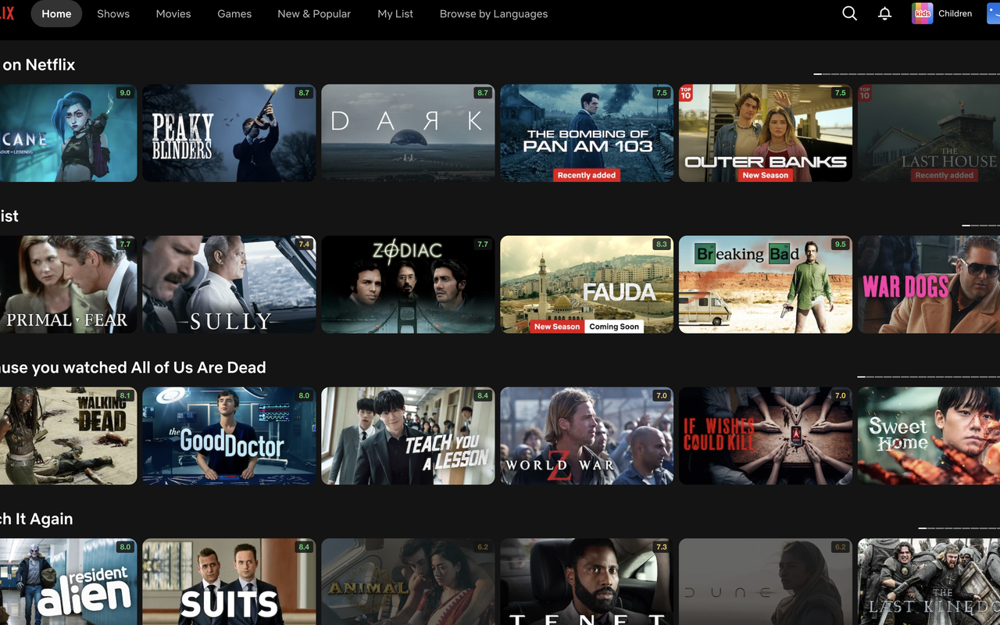
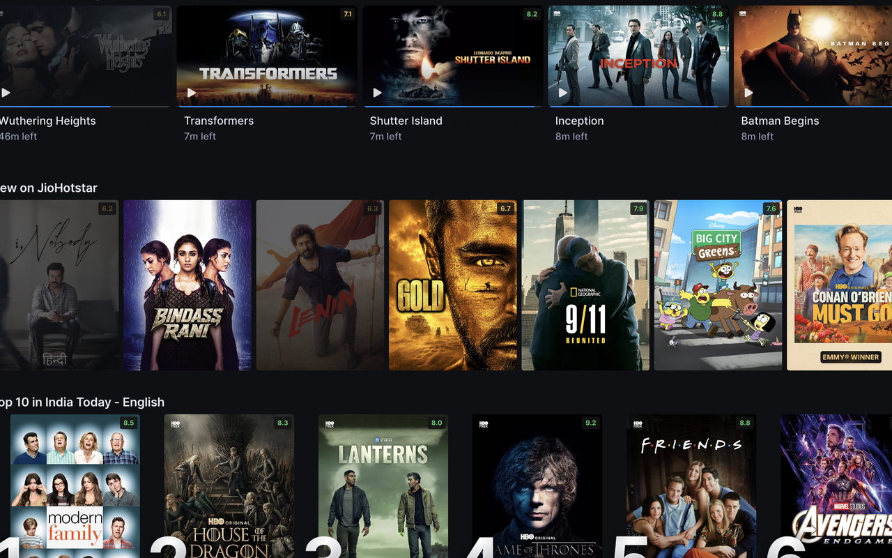

# Ratings for Netflix

Shows IMDb-sourced ratings on Netflix's hover preview card and on Hotstar tiles, with optional
color-coding and dimming of low-rated titles.

**Not affiliated with, endorsed by, or sponsored by Netflix, Hotstar, or IMDb.**

📦 **[Available on the Chrome Web Store](https://chromewebstore.google.com/detail/ratings-for-netflix/mkjdaopppcindamkonflobenpbdbjigp)**
— install it there instead of loading unpacked, unless you're developing on this repo.

## Screenshots

| Netflix | Hotstar |
| --- | --- |
|  |  |

## How it works

There is no server, no API key, and no bundled data. On first install (or whenever you click
**Rebuild index** in Options), a setup page opens with two URL fields prefilled with IMDb's official
public dataset files:

- Ratings: https://datasets.imdbws.com/title.ratings.tsv.gz (~8.6 MB)
- Titles: https://datasets.imdbws.com/title.basics.tsv.gz (~226 MB)

See https://datasets.imdbws.com/ for the full, always-current list of IMDb dataset files.

Clicking **Build index** asks Chrome to grant the extension permission to fetch from that exact host,
then downloads both files directly into your browser, joins them (movies / series / miniseries / TV
movies / TV specials with at least 50 votes), and stores the result in your browser's IndexedDB.
Nothing is uploaded anywhere — every fetch is your own browser talking directly to the link in the
field.

**To refresh the data later:** open Options → Rebuild index. The same two links will re-download the
current files from IMDb (IMDb updates them roughly daily), rebuilding your local index from scratch.
You can also point the fields at any mirror you trust instead of the official links.

Once the index is built, browsing Netflix makes **zero network requests** for ratings — every lookup
is a local IndexedDB read.

## Load the extension (unpacked, for development)

1. `chrome://extensions`
2. Enable Developer mode (top right)
3. **Load unpacked** → select this folder
4. The setup page opens automatically — click **Build index** and approve the permission prompt

## Settings

Options page (right-click the toolbar icon → Options, or via the popup):

- **Enable ratings on Netflix** — master on/off switch
- **Color-code the badge by score** — green ≥7.5, amber 6.0–7.4, red <6.0
- **Also show a small badge directly on tiles** — on by default. Hotstar has no usable hover preview
  card, so the on-tile badge is the only surface there; turn it off if you only want ratings on
  Netflix's hover card
- **Dim titles rated below _N_** — fades matching tiles in browse rows (titles with no rating found
  are never dimmed)
- **Rebuild index** — reopens the setup page

## Licence note on the IMDb data

IMDb's dataset files (https://datasets.imdbws.com/) are provided free for **personal, non-commercial
use**, with attribution. This extension never copies, hosts, or redistributes that data anywhere —
each user's own browser fetches directly from IMDb's server into that user's own local storage, which
keeps this close to a personal-use pattern. It is not a guaranteed-safe legal reading: pointing many
users at a bulk dataset for use inside a shared application is still a judgment call, and that residual
risk is knowingly accepted for this project rather than avoided by switching to a licensed data source.

Required attribution: *Information courtesy of IMDb (https://www.imdb.com). Used under IMDb's
non-commercial dataset terms.*

## Troubleshooting

- **No ratings appear at all:** open the setup page and confirm the index shows "ready". Check
  `chrome://extensions` → service worker console for errors.
- **Ratings stop appearing after a Netflix redesign:** Netflix rotates its markup periodically. All
  Netflix-specific selectors live in one file, [src/content/netflix-dom.js](src/content/netflix-dom.js) —
  that's the file to fix. Set `localStorage.NRX_DEBUG = "1"` on netflix.com and reload to see
  extraction-miss warnings in the console.
- **A specific title shows no rating:** it may be a localized Netflix title that doesn't match IMDb's
  English primary/original title (this extension doesn't index IMDb's `akas`/alternate-titles data),
  or it may genuinely have fewer than 50 IMDb votes.
